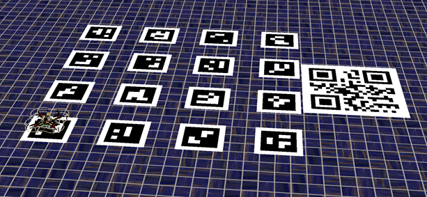

# INNER CAMP TASK
Соревновательный мир для внутренних отборов 2024

Как пользоваться:
1.	Импортируйте, настройте и запустите виртуальную машину
2.	Запустите Terminal Emulator с рабочего стола
3.	Выполните команду:
cd
4.	 Выполните команду:
git clone  https://github.com/edurin/inner_camp.git
5.	 Выполните команду: 
cd educational_worlds/
6.	 Выполните команду:
chmod +x ./test_world_download.sh
7.	 Выполните команду:
./test_world_download.sh
8.	Запустите симулятор Gazebo и убедитесь в правильной прогрузке мира.
